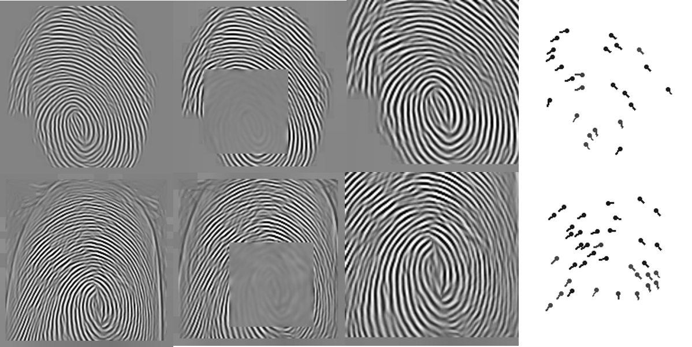

## A CNN-based Framework for Accurately Matching Contactless to Contact-based Fingerprints

**[Chenhao Lin](mailto:linchenhao@xjtu.edu.cn), [Ajay Kumar<sup>\*</sup>](mailto:ajay.kumar@polyu.edu.hk)

The Hong Kong Polytechnic University

### Overview of Cross Fingerprint
**A CNN-based Framework for Accurately Matching Contactless to Contact-based Fingerprints for cross matching contactless to contact-based fingerprints by using CNN.  

The paper has been accepted by TIFS 2018. For more details, please refer to our [paper](https://ieeexplore.ieee.org/abstract/document/8409476/).

<p align="left">

</p>

## Getting started
#### Requirements
1. Requirements for `Caffe` (see: [Caffe installation instructions](http://caffe.berkeleyvision.org/installation.html))
2. MATLAB

### Files

1. Folder "generation_of_ridge_map" includes matlab files for generating contactless and contact-based fingerprint ridge map.
	---- "generate_contactbased_cnn_enhance.m" and "generate_contactless_cnn_enhance.m" are the programs for generating contactless/contact-based fingerprint 
		 for CNN and enhanced fingerprint images  
	---- "generate_contactbased_cnn_enhance_enhance.m" and "generate_contactless_cnn_enhance_enhance.m" are the programs for contactless/contact-based 
		 fingerprint images further enhancement	
	
		 
2. Folder "generation_of_minutiae_map" includes matlab files for generating contactless and contact-based fingerprint minutiae map.		 
	---- "minutiae_map_extraction_contactbased.m", "minutiae_map_extraction_contactless.m" and "show_minutia.m" are the programs for extracting fingerprints 
		 minutiae and illustrating 
	---- "minutiae_map_generation_contactbased.m" and "minutiae_map_generation_contactless.m" are the programs for generating fingerprint minutiae maps

3. Folder "generation_of_core_point_region" includes matlab files for generating contactless and contact-based core point region ridge map and blurred core point region ridge map.		 
	---- "generate_contactless_center_pre.m" and "generate_contactbased_center_pre.m" are the programs for generating fingerprint core point images
	---- "generate_contactless_scale.m" and "generate_contactbased_scale.m" are the programs for generating scaled fingerprint images
	---- "generate_contactless_enhance.m" and "generate_contactbased_enhance.m" are the programs for generating enhanced fingerprint images
	---- "generate_contactless_enhance_enhance.m" and "generate_contactbased_enhance_enhance.m" are the programs for generating further enhanced fingerprint images
	---- "generate_contactless_core.m" and "generate_contactbased_core.m" are the programs for generating fingerprint core point region images
	---- "generate_contactless_img_blur.m" and "generate_contactbased_img_blur.m" are the programs for generating blurred fingerprint images	

4. Folder "caffe-train-test" includes caffe program, training and test files in this work.
	---- "ridgemap_first_layer_deploy.prototxt" is the model structure of first layer of fingerprint ridge flow map. 
    ---- "minutiaemap_first_layer_deploy.prototxt" is the model structure of first layer of fingerprint minutiae map. 
    ---- "ridgemap_minutiaemap_deploy.prototxt" is the model structure of combination of fingerprint minutiae map.
    ---- "core_region_deploy.prototxt" is the model structure of fingerprint core region. 
    ---- "blur_core_region_deploy.prototxt" is the model structure of fingerprint blurred core region. 
    ---- "ridgemap_minutiaemap_deploy_database_b.prototxt" is the model structure of combination of fingerprint minutiae map for database b.
    ---- "core_region_deploy_database_b.prototxt" is the model structure of fingerprint core region for database b. 
    ---- "blur_core_region_deploy_database_b.prototxt" is the model structure of fingerprint blurred core region for database b. 

In order to generate processed fingerprint images, we have used several publicly available codes/functions to enhance fingerprint image, extract fingerprint minutiae and detect fingerprint core point.
These codes/functions can be downloaded from http://www.peterkovesi.com/matlabfns/ (fingerprint enhancement) https://github.com/v12/online-fingerprint-verification-sdk (fingerprint minutiae extraction) and http://www.neurotechnology.com/verifinger.html (fingerprint core point detection)

## Citation
```
@article{lin2018cnn,
  title={A CNN-based framework for comparison of contactless to contact-based fingerprints},
  author={Lin, Chenhao and Kumar, Ajay},
  journal={IEEE Transactions on Information Forensics and Security},
  volume={14},
  number={3},
  pages={662--676},
  year={2018},
  publisher={IEEE}
}
```


### License

```
Copyright (c) 2018-present The Hong Kong Polytechnic University.

Permission is hereby granted, free of charge, to any person obtaining a copy
of this software and associated documentation files (the "Software"), to deal
in the Software without restriction, including without limitation the rights
to use, copy, modify, merge, publish, distribute, sublicense, and/or sell
copies of the Software, and to permit persons to whom the Software is
furnished to do so, subject to the following conditions:

The above copyright notice and this permission notice shall be included in
all copies or substantial portions of the Software.

THE SOFTWARE IS PROVIDED "AS IS", WITHOUT WARRANTY OF ANY KIND, EXPRESS OR
IMPLIED, INCLUDING BUT NOT LIMITED TO THE WARRANTIES OF MERCHANTABILITY,
FITNESS FOR A PARTICULAR PURPOSE AND NONINFRINGEMENT.  IN NO EVENT SHALL THE
AUTHORS OR COPYRIGHT HOLDERS BE LIABLE FOR ANY CLAIM, DAMAGES OR OTHER
LIABILITY, WHETHER IN AN ACTION OF CONTRACT, TORT OR OTHERWISE, ARISING FROM,
OUT OF OR IN CONNECTION WITH THE SOFTWARE OR THE USE OR OTHER DEALINGS IN
THE SOFTWARE.
```
# cross-fingerprint
